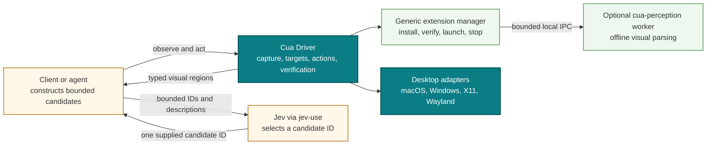
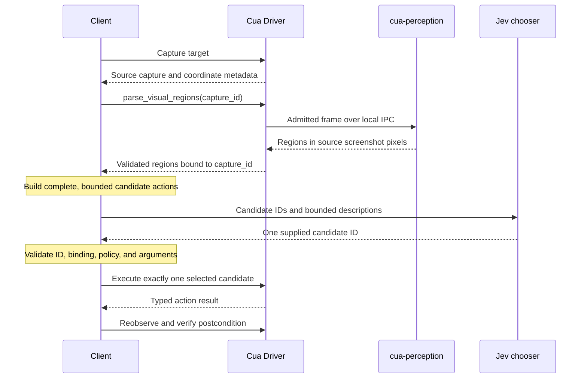

# RFC: Optional Cua Perception extension and jev-use boundary

## Summary

Cua Driver will add a provider-agnostic visual perception boundary without
embedding a model provider or machine-learning runtime in the default Driver
installation. Both `get_window_state` and `get_desktop_state` will publish a
Driver-owned capture ID for the exact screenshot they return. Driver will own a
bounded immutable capture registry, target identity, a lossless affine mapping
from source screenshot pixels to action coordinates, action execution,
verification, and a generic extension lifecycle. An optional, signed,
separately installed Rust worker and model bundle named `cua-perception` will
implement the first extension capability, `parse_visual_regions`, returning
typed text and icon regions in the exact pixel coordinate space of one source
screenshot.

Jev integration will remain above Driver in a public recipe, guide, examples,
and skill named `jev-use`. The client will construct a bounded set of complete
Driver actions from a current observation. Jev may select only a candidate ID;
the client must validate that selection before asking Driver to execute it.
Each loop uses one captured frame for at most one action and then reobserves.

The default MIT-distributed Driver install and the external
`cua-agent[omni]` / `cua-som` path will continue to work without
`cua-perception`, a Jev credential, or network access. The optional perception
bundle may use the pinned OmniParser v2 icon artifact under the repository's
existing AGPL path, with artifact-specific notices and corresponding source;
that does not change the default Driver's distribution. Required pull-request
checks will use local fixtures and mock providers. Cross-platform live Jev
video evidence is a separate implementation exit gate tied to the exact final
candidate, not a required automatic pull-request check.

## Motivation

Cua Driver clients can observe accessibility trees, browser state, and
screenshots, but Driver does not expose a first-party typed contract for
turning a screenshot into OCR and icon regions without the existing Python ML
stack. Applications therefore either maintain their own capture-to-model
bridge, depend on a heavier runtime, or let a provider-specific integration
collapse observation, decision, and action into one opaque step.

Those choices obscure important ownership boundaries. Driver must be able to
say which exact pixels were captured, which target they describe, how a point
maps back to an action, whether an action was admitted, and what happened after
execution. A perception implementation should identify regions without gaining
desktop permissions or action authority. A remote decision provider should not
be able to invent arbitrary Driver calls or return unbound coordinates.

The external Jev work in [#3915](https://github.com/trycua/cua/issues/3915) and
[#3916](https://github.com/trycua/cua/pull/3916) demonstrates a useful,
mockable decide loop in Python and TypeScript. The provider-specific Driver tool
proposed in [#3914](https://github.com/trycua/cua/pull/3914) demonstrates the
latency benefit of a bounded chooser and identifies useful projection and deny
list concerns. This RFC retains those lessons while choosing a generic Driver
contract: Jev credentials, requests, prompts, retries, and decisions do not
belong in Driver or the perception worker.

## Goals

- Define a model-neutral contract for parsing text and icon regions from one
  Driver screenshot.
- Publish immutable capture IDs for the exact screenshots returned by both
  window and primary-desktop observations.
- Preserve exact, testable source screenshot coordinates and the complete
  snapshot-owned affine mapping through candidate construction and action
  dispatch.
- Make `cua-perception` optional, Rust-based, explicitly installed, and absent
  from the default Driver distribution.
- Define a reusable extension lifecycle that is not special-cased to one
  worker, model, provider, or capability.
- Keep capture, perception, decision, action, and verification as separate
  typed stages with explicit ownership.
- Keep Jev outside Driver through a credential-free, mockable `jev-use`
  integration in Python and TypeScript.
- Preserve existing Driver behavior and the external `cua-agent[omni]` /
  `cua-som` path while a measured migration is reviewed separately.
- Provide equivalent public contracts and focused evidence across Rust,
  Python, TypeScript, CLI, MCP, macOS, Windows, X11, and supported Wayland
  environments.

## Non-goals

- Add Jev, TypeSafe credentials, provider HTTP code, prompts, or retry policy to
  Cua Driver or `cua-perception`.
- Let a model provider construct Driver tool names, arguments, coordinates, or
  free-form executable actions.
- Add Python, an inference runtime, model weights, or automatic model downloads
  to the default Driver installation.
- Replace accessibility, DOM, browser, or external `cua-som` observations.
- Merge, publish, or enable an extension release as part of accepting this
  architecture.
- Standardize a universal task-planning or autonomous-agent policy.
- Claim that visual regions are stable across captures or may be reused after
  any action, target change, resize, scroll, or display-layout change.

## Terminology

**Source capture**
: A proposed bounded immutable Driver registry record containing one screenshot,
its window or primary-desktop target identity, runtime/session generation, and
its lossless screenshot-to-action affine transform. Its opaque capture ID names
that retained observation, not a live surface. Driver does not retain this kind
of record today.

**Screenshot pixel space**
: Integer pixel coordinates in the encoded source screenshot. Its origin is
`(0, 0)` at the top-left pixel; x increases right and y increases down.

**Visual region**
: A typed text or icon detection whose half-open bounding rectangle is expressed
in source screenshot pixels and is bound to the source capture.

**Extension**
: An optional, separately installed component described by a versioned manifest
and managed through a generic Driver lifecycle. An extension advertises
capabilities but receives no implicit Driver authority.

**Perception worker**
: The sandboxable `cua-perception` process that accepts bounded frames over a
local versioned protocol and returns visual regions. It does not capture the
desktop or execute actions.

**Candidate action**
: A complete, locally constructed Driver operation with an opaque candidate ID,
target, arguments, source capture binding, and any caller policy metadata.

**Chooser**
: A component that receives a bounded description of candidate actions and may
return one supplied candidate ID. `abstain` and `reobserve` are reserved local
candidate IDs rather than separate provider result types. Jev is one chooser
used by `jev-use`; it is not part of Driver.

## Current state

Driver already owns platform capture and action dispatch, including the
platform-specific work needed to interpret window and desktop coordinates. Its
`get_window_state` and `get_desktop_state` operations return screenshots, while
window state can also contain an element `snapshot_id`, `screenshot_width`,
`screenshot_height`, optional `screenshot_scale`, and platform-dependent frame
metadata. Neither operation currently publishes a Driver-owned screenshot
capture ID. The element snapshot ownership decision in
[RFC #3473](https://github.com/trycua/cua/issues/3473), implemented for the
desktop slice by merged [#3616](https://github.com/trycua/cua/pull/3616), does
not retain immutable screenshot bytes or give an old screenshot an actionable
capture identity.

The current `screenshot_frame_valid` field is not a portable capture-validity
contract. macOS emits true or false when it can establish or reject its frame;
Linux emits false for a failed surface-identity check; Windows does not provide
an equivalent affirmative signal. It cannot be used as proof that screenshot
coordinates remain current or that their transform is still the one an action
will use.

The old `capture_mode="som"` value is a deprecated ignored compatibility alias;
Driver now returns its tree and screenshot independently of that value. The
current Python `cua-som` package and OmniParser loop live under
`cua-agent[omni]`, outside Driver capture. There is no generic installed-
extension lifecycle, retained screenshot capture registry, or portable
`parse_visual_regions` contract today.

[#3915](https://github.com/trycua/cua/issues/3915) requests a deterministic,
credential-free example in which a client builds executable actions, a
mockable Jev-compatible chooser selects one, Driver executes it, and the client
checks an independent postcondition. [#3916](https://github.com/trycua/cua/pull/3916)
implements and validates that external-loop shape in Python and TypeScript. It
does not change Driver's public runtime contract and does not depend on a
provider-specific Driver tool. This RFC treats that work as prior art and the
starting point for the `jev-use` integration, subject to the final contracts
defined here.

[#3914](https://github.com/trycua/cua/pull/3914) proposes an optional
`suggest_action` tool inside Driver, backed directly by Jev and enabled by a
provider credential. Its measurements and tests provide useful evidence that a
small bounded chooser can reduce decision latency, that deny filtering must be
enforced locally, and that a chooser should never execute an action. This RFC
does not adopt its provider-specific placement or runtime contract. The generic
perception result and external candidate-selection loop provide the extension
point instead.

## Proposal

### Component ownership

The architecture separates deterministic desktop authority from optional local
perception and external decision providers.

Driver owns capture, target resolution, action admission, dispatch, action
results, and observation after an action. The extension manager owns artifact
verification and worker process lifecycle. `cua-perception` owns only the
transformation of an admitted frame into model-neutral regions. The client owns
candidate construction, provider disclosure, candidate validation, and loop
policy. Jev owns only the choice among the bounded IDs the client supplies.

No dependency points from Driver or `cua-perception` to a Jev SDK, endpoint,
credential, request schema, prompt, or response type.

### Generic extension lifecycle

Driver will expose a generic `cua-driver extension` CLI namespace with `list`,
`inspect`, `status`, `install`, `update`, and `remove` operations. An optional
MCP install action may project the same installer operation, but it is state-
changing and must require an explicit confirmation gate. Extension installation
and removal are not added as ordinary generated SDK operations. The first named
extension is `perception`, but lifecycle types and protocol negotiation must not
encode `cua-perception` as the only possible extension.

The lifecycle covers:

1. listing installed and available extension metadata;
2. inspecting the exact version, target triple, capabilities, protocol range,
   model metadata, artifact sizes, content hashes, destination, licenses, and
   current health;
3. explicitly installing or updating a selected version after presenting that
   information;
4. verifying a signed, target-specific catalog entry against a pinned publisher
   identity, then verifying the manifest, artifacts, hashes, platform
   compatibility, and protocol compatibility before execution;
5. launching a worker on demand, completing a versioned handshake, bounding
   request concurrency and time, and reusing or restarting it according to
   declared lifecycle policy;
6. cancelling requests and terminating unhealthy, timed-out, incompatible, or
   idle workers without affecting Driver's core runtime; and
7. explicitly removing extension-owned artifacts when they are not in use.

Installation is never an implicit side effect of observation,
`parse_visual_regions`, Driver startup, or a default Driver upgrade. The first
parse must return a structured not-installed error rather than download code or
weights. Release artifacts remain inert until their separate publication and
installer changes are reviewed.

The CLI command `cua-driver extension install perception` is the explicit
installation action. Before changing disk state it presents the exact worker,
runtime, and model artifacts; target and versions; download and installed
sizes; destination; publisher identity; hashes; licenses; provenance; and
corresponding-source location. A confirm-gated MCP projection may use a
two-step preview and confirmation flow. Local development artifacts use a
separate mode that labels them as unsigned local code and cannot impersonate
the verified release path.

The extension manifest declares capabilities and resource needs; it does not
grant them. A worker receives one admitted input frame through local IPC and a
bounded output channel. It must not receive desktop capture, accessibility,
input, browser, or Driver policy capabilities.

### `parse_visual_regions` contract

`parse_visual_regions` will be a public, generated, model-neutral Driver tool
available through the normal typed tool/SDK generation after the capture
registry and tool integration exist. Capture remains a separate Driver
operation. The parse request refers to one immutable source capture and may
supply only bounded parsing options defined by the contract, such as which
region kinds to request. It cannot name a provider or arbitrary model prompt.

The capture registry is a prerequisite, not current behavior. It extends the
runtime-owned publication, resolution, and retirement model selected in
[RFC #3473](https://github.com/trycua/cua/issues/3473) and implemented for
element identity and native payloads by
[#3616](https://github.com/trycua/cua/pull/3616). It retains bounded immutable
screenshot bytes and their interpretation metadata under the same runtime and
session ownership. [Issue #3630](https://github.com/trycua/cua/issues/3630)
owns the selected screenshot-transform follow-up, implemented in draft
[#3942](https://github.com/trycua/cua/pull/3942). Its implementation must remove
the current independently mutable transform path rather than add a second
registry. Both `get_window_state` and `get_desktop_state` publish a generated
`capture_id` for their exact returned screenshot; desktop capture supports the
primary display in v1.

The public result contains:

- the opaque source capture ID;
- the source screenshot's exact `screenshot_width` and `screenshot_height`;
- the source target identity, runtime/session generation, snapshot identity
  where applicable, and complete lossless affine transform needed by Driver to
  validate and map a later action;
- the perception extension and model versions used;
- zero or more typed `text` and `icon` regions;
- a stable region ID unique within this result;
- an integer bounding rectangle `{x, y, width, height}` for each region;
- recognized text or a model-neutral icon label when available;
- bounded confidence and optional parent or grouping relationships; and
- structured warnings and timing metadata that contain no screenshot content.

Rectangles use half-open bounds
`[x, x + width) x [y, y + height)`. They must have positive size and remain
inside `[0, screenshot_width) x [0, screenshot_height)`. The contract does not
use CSS pixels, logical points, percentages, normalized coordinates,
display-scaled coordinates, or coordinates from a model's resized input.

The first callable implementation accepts native-resolution window and primary-
desktop captures. The public coordinate contract nevertheless preserves the
registry's complete lossless affine transform rather than collapsing it to a
single scale or scale-plus-translation approximation. Actionable resized
captures remain blocked until the #3630/#3942 snapshot-owned implementation and
cross-platform evidence prove that exact transform; clients must not mutate or
temporarily override a global `max_image_dimension` setting to create an
actionable perception capture.

The worker may resize, pad, tile, or otherwise preprocess an image internally
only when it records the exact forward transform and applies its tested inverse
to every returned rectangle. All public rectangles must be mapped back to the
source capture's native-resolution `screenshot_width` by `screenshot_height`
pixel space before the worker responds. Driver validates all output bounds and
rejects the whole result if the capture binding, dimensions, types, limits, or
mapping invariants are invalid. Driver does not silently clamp invalid regions.

Once the prerequisite registry lands, its record will retain the full affine
mapping from screenshot pixels to the platform-specific action coordinate
space. Derived centers preserve fractional values until the platform dispatcher
applies its reviewed rounding. A client may use a region to build a candidate
only through that record and with the same target and capture ID. Driver
atomically acquires that capture for at most one action, maps through the stored
transform, revalidates the live target, dispatches once, and consumes the action
right. It rejects missing, retired, already consumed, cross-runtime,
cross-session, stale, malformed, or mismatched captures without falling back to
unconstrained coordinates. Capture binding detects accidental mixing; it does
not prove that an unchanged live target still matches old pixels.

The contract returns observations, not action recommendations. OCR text is
observed content and grants no interactivity authority. An icon label or
apparent button shape is heuristic, not proof that a region is actionable.
Accessibility and DOM evidence remain the semantic authority when present, and
Driver's native target validation remains authoritative at action time. The
result contains no Driver tool name, action arguments, provider decision,
generated input text, or instruction to click.

### One capture, one action, then reobserve

The normative interaction loop is:

A client may perform multiple local parses of the same immutable frame for
diagnosis, but it may dispatch at most one action derived from that capture.
After an action attempt, including a timeout, partial delivery, unknown outcome,
or suspected no-op, the client must reobserve before selecting another action.
It must also reobserve after any known target mutation, resize, move, scroll,
navigation, display-layout change, or loss of target identity.

Driver does not claim that pixels remain current between capture and action.
Existing authorization, foreground ownership, session, and action-result rules
still apply. A caller must treat an unknown action outcome as requiring
observation, never blind replay.

### `jev-use` candidate selection

`jev-use` is the public name for the external integration recipe, guide,
examples, and skill. It will provide equivalent Python and TypeScript flows and
a deterministic mock chooser. Live Jev support is an optional adapter above
the same narrow chooser interface.

Before calling the chooser, the client constructs a bounded collection of
candidate records. Each record contains:

- an opaque ID generated for this decision step;
- a complete supported Driver action and its validated arguments;
- the target and source capture binding;
- a bounded human-readable description derived from allowed observation data;
  and
- local policy metadata such as whether the candidate is denied.

The collection also contains reserved local candidates. `abstain` means the
chooser declines to select an executable action. `reobserve` means the client
should obtain a fresh Driver observation before building a new set. They travel
through the same candidate-ID selection and validation path as executable
candidates, but the client handles them locally and sends no Driver action.

Denied candidates are removed before any provider request. The provider
receives only the IDs and bounded descriptions required to choose; executable
arguments, opaque Driver tokens, screenshots, accessibility trees, or other
content are disclosed only when the recipe explicitly documents and the caller
opts into that data flow. The base example requires none of them.

The chooser returns exactly one supplied candidate ID. The client rejects
unknown, duplicate, denied, stale, malformed, or capture-mismatched selections.
It handles `abstain` or `reobserve` locally; otherwise it revalidates the chosen
action against the local allowlist and current Driver contract before dispatch.
Jev never returns a tool name, free-form JSON arguments, coordinates, code, or
generated text for Driver to execute.

Driver and `cua-perception` remain fully usable without the `jev-use` materials.
Changing providers requires a client adapter, not a Driver extension or public
Driver contract change.

### Errors and observability

The public contract distinguishes at least these failures:

- extension not installed;
- unsupported platform or target;
- manifest, artifact, or license metadata invalid;
- incompatible extension protocol or capability version;
- worker launch, handshake, cancellation, crash, or timeout;
- invalid frame, source binding, dimensions, or worker output;
- inference unavailable or model initialization failed; and
- resource limits exceeded.

Errors must not fall through to an automatic download, another provider, the
legacy Python path, or an action. Worker crashes and timeouts cannot terminate
the Driver process. Driver may restart a worker for a later explicit request,
but it must not replay the failed parse automatically when the outcome is
ambiguous.

Diagnostics may include extension versions, model versions, durations, counts,
dimensions, error categories, and content-free hashes. They must not contain
screenshot bytes, recognized text, icon labels derived from private content,
provider prompts, provider responses, credentials, or arbitrary candidate
descriptions by default.

## Alternatives considered

### Put a Jev-backed `suggest_action` tool in Driver

[#3914](https://github.com/trycua/cua/pull/3914) offers a focused implementation
and evidence for this design. Keeping provider logic in Driver would make the
initial integration direct, but it would also add provider credentials,
egress, request semantics, and policy behavior to Driver's runtime and tool
inventory. Each additional provider would pressure Driver to grow another
conditional tool or a provider abstraction shaped by the first implementation.

The selected boundary retains the bounded selection idea while moving provider
logic above Driver. Driver exposes deterministic observations and actions; the
client decides which provider, if any, may choose among locally constructed
candidates.

### Let the provider return coordinates or complete tool calls

This reduces client code but lets remote output invent authority-bearing action
arguments and makes stale-frame or coordinate-space confusion harder to detect.
Opaque candidate IDs keep the executable set finite and locally reviewable.

### Fold capture into `parse_visual_regions`

A combined operation is convenient but hides which frame was parsed and makes
it easier for perception, decision, and action to observe different pixels.
Separate capture and parsing establish one immutable input, allow deterministic
replay fixtures, and keep the worker free of desktop permissions.

### Make perception part of the default Driver install

Bundling a runtime and model would increase install size, platform packaging,
license surface, startup concerns, and release coupling for every user. An
explicit optional extension keeps the default distribution unchanged and makes
artifact provenance visible before installation.

### Replace the external `cua-agent[omni]` / `cua-som` path immediately

Existing agent users have a working Python OmniParser path with different
dependencies and behavior. It is not a Driver capture mode. Immediate
replacement would turn a new contract into an unmeasured migration. Both paths
remain available until separate evidence and review justify a deprecation.

## Compatibility and migration

This proposal is additive. Without the optional extension installed, Driver's
default artifacts, startup, tool inventory outside the new advertised contract,
capture behavior, and actions remain unchanged. The external
`cua-agent[omni]` / `cua-som` path also remains unchanged. Calls to
`parse_visual_regions` return a structured not-installed result.

Contract versions for the extension manifest, worker protocol, and public
visual-region schema evolve independently. Driver negotiates a supported worker
protocol before sending a frame and rejects incompatible combinations. Public
SDK generation must keep typed structured inputs and outputs structurally
equivalent across Rust, Python, TypeScript, CLI, and MCP. Transport envelopes,
image content blocks, and presentation text may differ where their protocols
require it.

The external `cua-agent[omni]` / `cua-som` path remains supported. Development
uses it as a behavioral reference and parity oracle on a frozen screenshot
corpus. After the Driver tool is released, the Python agent loop may add an
opt-in `parse_visual_regions` path. Making that path the default requires
release availability plus cross-platform usage, quality, and compatibility
evidence. Deprecating Python requires a later, separately reviewed change with
an explicit migration window and user communication. There is no automatic
fallback between the two systems because that would hide dependency, privacy,
performance, and output differences.

Rollback consists of disabling or removing the optional extension and using
the prior Driver release or existing observation modes. Extension removal must
not modify agent-owned `cua-som` assets or configuration.

## Security, privacy, and telemetry

Driver remains the process that holds desktop capture, accessibility, browser,
and input permissions. The worker receives only the admitted screenshot bytes
and bounded options for one parse. It runs without network access during
parsing and without desktop, accessibility, input, browser, credential-store,
or provider permissions. Platform-native containment must enforce the claimed
process, filesystem, network, descriptor, memory, permission, and descendant-
cleanup boundaries. A platform returns `unsupported_platform` and does not
launch the production worker until those boundaries are proved; process-tree
supervision alone is insufficient.

Installation presents the exact extension version, target, artifact and model
sizes, cryptographic hashes, destination, licenses, and publisher provenance.
The installer verifies a signed target-specific catalog entry and pinned
publisher identity before verifying each artifact. Archive-provided hashes
alone do not establish publisher identity. The pinned OmniParser v2 icon
artifact may ship in this optional AGPL-governed component only with its exact
revision, original and converted hashes, artifact-specific license, applicable
notices, and corresponding source. The inference runtime and every OCR or model
artifact retain their own provenance and license record. The default Driver
remains MIT-distributed. No code or weights are fetched on first parse, and
update checks do not install or activate an update.

`jev-use` owns any external disclosure. Its default and required-test path uses
a local deterministic chooser and no credential. Live use must document what
leaves the machine, use explicit user configuration, and keep secrets out of
arguments, logs, fixtures, telemetry, and evidence. Driver must not read,
store, forward, or infer a Jev credential.

Telemetry is content-free and opt-in under existing Driver policy. It may count
extension lifecycle outcomes, error categories, durations, frame dimensions,
and region counts. It may not record screenshot content, OCR text, labels,
candidate descriptions, Jev prompts or responses, credentials, or action
arguments derived from private content.

## Implementation plan

Implementation will use isolated, independently reviewable pull requests. Work
may proceed in parallel where contracts or fixtures provide a stable seam, but
release and integration pull requests remain subject to their implementation,
evidence, legal, and publication gates after this RFC is accepted.

1. Establish a distinct `cua-perception` component release stream before any
   `feat` or release-producing pull request. Review its version source, tag
   prefix, release workflow, artifact names, supported targets, installer
   resolution, checksums, licenses, and rollback path. Repository-wide Latest
   is not a component release contract.
2. Land protocol and inference spikes as explicitly non-releasing work. They may
   define fixtures and measure feasibility, but cannot publish artifacts,
   change the default installer, or advertise a supported public capability.
3. Run a separate sandbox/restriction spike on macOS, Windows, X11, and
   supported Wayland environments. Prove the worker lacks network, desktop
   capture, accessibility, input, browser, and credential-store capabilities;
   keep the production worker disabled with `unsupported_platform` wherever the
   claimed boundary has not been proved.
4. Add the bounded immutable capture registry on the #3473/#3616 runtime-owned
   lifecycle in coordination with #3630. Publish capture IDs for exact window
   and primary-desktop screenshots and retain the complete affine transform.
   The first perception slice accepts native-resolution captures only. Resized
   actionable captures wait for #3630's snapshot-owned transforms and removal
   of replaced mutable transform ownership.
5. Define the versioned extension manifest, `cua-driver extension ...`
   lifecycle, worker handshake, error vocabulary, and deterministic conformance
   fixtures.
6. Define `parse_visual_regions`, native-resolution coordinate invariants,
   generated Rust/Python/TypeScript shapes, CLI and MCP projections, and golden
   structured-contract tests.
7. Implement the Rust `cua-perception` worker against protocol fixtures, with
   offline inference, bounded preprocessing, exact inverse mapping, limits,
   cancellation, and invalid-output tests.
8. Build per-platform worker and model artifacts with signed target-specific
   catalog entries, hashes, provenance, artifact-specific licenses, required
   notices and corresponding source, reproducible metadata, and no publication
   side effect.
9. Add explicit extension inspect/install/update/remove CLI behavior and an
   optional confirm-gated MCP install action after artifact review, preserving
   an unchanged default Driver install.
10. Integrate capture-to-worker IPC, generated `parse_visual_regions` surfaces,
    validation, lifecycle isolation, and structured failures.
11. Continue the `jev-use` preview lane from #3915 and #3916 independently now.
    It can refine the external recipe, mock chooser, reserved candidates,
    guide, examples, and skill without waiting for Driver perception and without
    depending on #3914's Driver tool.
12. Land migration measurements and quality results as separately attributable
    work, then certify the exact stable candidate across the canonical macOS,
    Windows, and Linux desktop harnesses before a public contract or release
    pull request is made ready or merged.
13. Produce truthful source videos on macOS, Windows, and Linux X11 from the
    exact final candidate, using the real signed perception artifact, real
    packaged inference, live Jev bounded-ID choice, one capture-bound action,
    and an independent postcondition. Fully decode and inspect all three clips
    and an evidence-linked combined reel before implementation is complete.

The non-releasing protocol, inference, sandbox, capture-registry, and `jev-use`
preview lanes can proceed in parallel where fixtures provide a stable seam.
Worker packaging waits for the sandbox result and release-stream decision.
Driver perception integration waits for the capture registry, lifecycle, and
public contract. Publication, default-install changes, and external
`cua-agent[omni]` / `cua-som` deprecation are separate delivery decisions and
are not authorized by accepting this RFC.

## Test and acceptance plan

Credential-free pull-request checks must prove:

- structural equivalence of typed `parse_visual_regions` inputs and structured
  outputs across Rust, Python, TypeScript, CLI, and MCP, while allowing
  transport-specific envelopes and image content blocks;
- half-open rectangle invariants, exact tested inverse mapping through any
  resize/pad/tile preprocessing, complete affine source-to-action fixtures,
  reviewed platform rounding, rejection rather than clamping, and native-
  resolution coordinate fixtures;
- bounded capture publication, resolution, retirement, runtime/session
  isolation, late completion, and removal of replaced mutable transform state;
- exact screenshot digest binding and capture-ID publication from both
  `get_window_state` and primary-display `get_desktop_state`;
- binding of every result and candidate to one capture, target, and screenshot
  geometry;
- enforcement of one capture, at most one derived action, and reobservation
  after every action outcome;
- generic extension install-state, version negotiation, protocol mismatch,
  cancellation, timeout, crash recovery, idle cleanup, and removal behavior;
- signed catalog and pinned publisher verification, with unsigned development
  artifacts unable to enter the verified release path;
- no automatic download, network access during parse, or permission inheritance
  by the worker, and fail-closed `unsupported_platform` behavior until native
  containment is proved;
- offline parsing after an explicit fixture installation;
- deterministic Python and TypeScript `jev-use` end-to-end runs through real
  Driver MCP tools with a mock chooser;
- rejection of unknown, stale, denied, duplicate, and malformed candidate IDs;
- an unchanged default Driver installation and continued external
  `cua-agent[omni]` / `cua-som` coverage; and
- focused native coordinate and lifecycle coverage on macOS, Windows, X11, and
  supported Wayland compositors, with explicit limitations where parity is not
  possible.

Perception quality will be measured on a versioned redistributable corpus with
separate OCR, icon, bounding-box, latency, memory, and artifact-size results.
The thresholds and corpus version must be approved before release artifacts are
published; a live provider result cannot substitute for these local measures.

An optional live Jev check may run manually only after reviewer authorization,
against synthetic content and an exact trusted commit. It supplements rather
than gates required CI, records no credential or sensitive provider payload,
and reports the exact adapter and provider versions. Required CI never depends
on a provider account, secret, network availability, or billing state.

Once implementation is stable, run the canonical Windows, Linux, and macOS
desktop E2E harnesses on the exact candidate SHA. Record the SHA and any
platform or compositor limitation. If executable code, generated contracts,
artifacts, or the harness changes afterward, rerun the affected evidence before
readiness.

The architecture is not fully implemented until that exact final candidate also
produces reviewable source videos on macOS, Windows, and Linux X11 plus one
combined highlight reel. Each source run must use real packaged inference and
live Jev against a deterministic synthetic fixture with no useful AX or DOM
target; show the capture ID, bounded candidates, selected ID, exactly one
capture-bound action, and a fresh observation; and verify success through an
independent fixture oracle. Each clip must have a redacted evidence manifest
that pins the Driver SHA, extension and model hashes, Jev adapter identity,
platform/session, capture trace, candidate set, selected ID, and verification
result. Full decode, representative-frame inspection, privacy review, and
shot-to-source traceability are required. These videos supplement rather than
replace the canonical desktop harnesses and credential-free CI, and publication
requires separate authorization.

## Resolved implementation decisions

- Both window and primary-desktop screenshot operations publish immutable
  Driver-owned capture IDs for their exact returned bytes.
- Public regions stay in source screenshot pixels; Driver retains the complete
  affine source-to-action transform and permits at most one derived action.
- Perception is an explicitly installed, signed, optional Rust extension that
  parses offline without Python or network access after installation.
- The optional OmniParser icon path may be AGPL-governed with artifact-specific
  notices and corresponding source; the default Driver remains MIT-distributed.
- Jev remains external and can select only one ID from a bounded client-built
  candidate table.
- Python `cua-som` remains supported and serves as a parity oracle; default
  migration and deprecation are separate decisions.
- Worker support fails closed per platform until the claimed native sandbox and
  lifecycle boundary is proved.
- Exact-candidate macOS, Windows, and Linux X11 live-video evidence is an
  implementation exit gate, not a substitute for automated or harness tests.

## Post-acceptance release and legal gates

Accepting this RFC approves the architecture, not publication of the extension
or model artifacts. Publication remains blocked until the following gates are
complete:

- Verify the exact OmniParser icon revision, conversion, hashes, notices, and
  corresponding-source bundle from a clean recipient installation.
- Complete provenance and redistribution review for the preferred
  EasyOCR-compatible ONNX artifacts; use separately pinned Apache-2.0 PP-OCRv5
  mobile artifacts if that record remains incomplete.
- Approve the redistributable corpus and numerical OCR, icon-box, latency,
  memory, and artifact-size release thresholds from measured Python and Rust
  results.
- Certify each platform's specific containment mechanism and published resource
  limits; unsupported platforms remain disabled rather than receiving a weaker
  boundary.
- Verify signed release catalogs, publisher identity, target archives, licenses,
  provenance, rollback metadata, and component-specific distribution resolution
  before publishing any extension artifact.

## Decision record

On 2026-09-17, the maintainer discussion selected the provider-agnostic scope
for implementation work during RFC review:

- Driver owns capture, targeting, actions, verification, generic extension
  lifecycle, and the visual-region contract.
- The visual-region contract depends on a bounded immutable screenshot capture
  registry built on #3473/#3616 ownership and the selected #3630 transform
  follow-up; current element `snapshot_id` values are not screenshot IDs.
- `get_window_state` and primary-display `get_desktop_state` publish capture IDs
  for exact screenshot bytes, with complete affine mappings retained by Driver.
- `cua-perception` is optional, Rust-based, explicitly installed from a signed
  target-specific catalog, offline after installation, and absent from the
  default MIT Driver install.
- The optional OmniParser v2 icon path may carry AGPL obligations only with
  artifact-specific notices, exact provenance, and corresponding source.
- `jev-use` stays above Driver; the client constructs complete bounded actions,
  Jev selects a candidate ID, and the client validates it before execution.
- One capture authorizes at most one action; all outcomes require reobservation.
- Packaged worker support fails closed until each platform's claimed sandbox
  boundary is proved.
- Required pull-request checks are credential-free; live Jev evidence is
  manual, synthetic, and tied to an exact trusted commit, while final three-
  platform source videos and their combined reel remain an implementation exit
  gate.
- Existing `cua-agent[omni]` / `cua-som` users keep their current external path
  until a separately reviewed migration decision.

On 2026-09-18, the maintainer accepted this RFC with the provider-agnostic scope
and delivery boundaries above unchanged. The accelerated review is appropriate
because implementation PR #3943 remains draft, exact-candidate SHA evidence is
still required across the supported platforms, and extension and model
publication remains blocked pending legal and license review.

- [x] The provider-agnostic architecture is accepted for implementation.
- [ ] Complete the release and license verification above before approving
      extension or model publication.
- [ ] Complete implementation PR #3943, including ordinary pull-request CI and
      the required exact-candidate SHA evidence, before it may be made ready or
      merged.

Disposition: accepted. This decision does not authorize extension publication,
a default-installer change, external `cua-som` deprecation, implementation pull-
request merge, release, or deployment.
